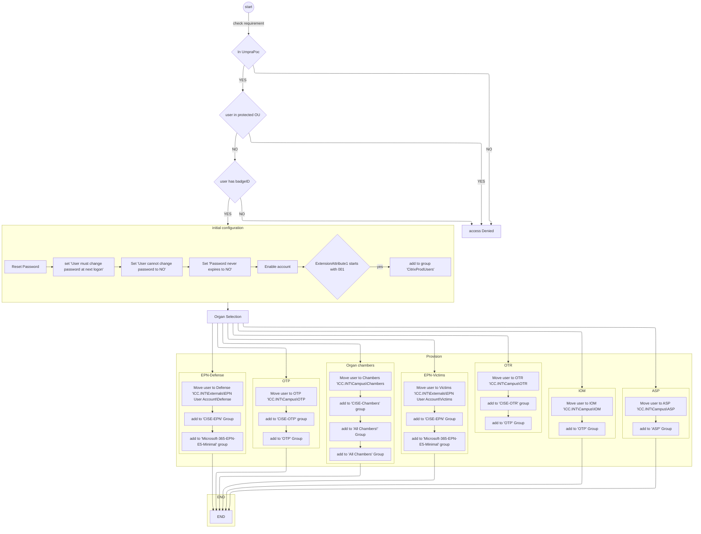

```mermaid
flowchart-elk
    subgraph initial [initial configuration]
    direction LR
        PWD[Reset Password]-->changePWD0[set 'User must change password at next logon']
        changePWD0 --> changePWD1[Set 'User cannot change password to NO']
        changePWD1 --> changePWD2[Set 'Password never expires to NO']
        changePWD2 --> changePWD3[Enable account]
        changePWD3 --> ext01{ExtensionAttribute1 starts with 001}
        ext01 --> |yes|Citrix[add to group 'CitrixProdUsers']
    end
    subgraph provision[Provision]
    subgraph Chambers [Organ chambers]
        direction TB
        moveChambers[Move user to Chambers 'ICC.INT\Campus\Chambers]
        moveChambers --> Cise-Chambers[add to 'CISE-Chambers' group]
        Cise-Chambers --> AllChambers1[add to 'All Chambers!' Group]
        AllChambers1 --> AllChambers2[add to 'All Chambers' Group]
    end
    subgraph OTP [OTP]
        direction TB
        moveOTP[Move user to OTP 'ICC.INT\Campus\OTP]
        moveOTP --> Cise-OTP[add to 'CISE-OTP' group]
        Cise-OTP --> OTPGroup[add to 'OTP' Group]
    end
    subgraph OTR [OTR]
        direction TB
        moveOTR[Move user to OTR 'ICC.INT\Campus\OTR]
        moveOTR --> Cise-OTR[add to 'CISE-OTR' group]
        Cise-OTR --> OTRGroup[add to 'OTP' Group]
    end
    subgraph IOM [IOM]
        direction TB
        moveIOM[Move user to IOM 'ICC.INT\Campus\IOM]
        moveIOM --> IOMOTRGroup[add to 'OTP' Group]
    end
    subgraph ASP [ASP]
        direction TB
        moveASP[Move user to ASP 'ICC.INT\Campus\ASP]
        moveASP --> ASPGroup[add to 'ASP' Group]
    end
    subgraph EPN-Defense [EPN-Defense]
        direction TB
        moveEPND[Move user to Defense 'ICC.INT\Externals\EPN User Account\Defense]
        moveEPND --> EPNDGroup[add to 'CISE-EPN' Group]
        EPNDGroup --> EPNDM365[add to 'Microsoft-365-EPN-E5-Minimal' group]
    end
    subgraph EPN-Victims [EPN-Victims]
        direction TB
        moveEPNV[Move user to Victims 'ICC.INT\Externals\EPN User Account\Victims]
        moveEPNV --> EPNVGroup[add to 'CISE-EPN' Group]
        EPNVGroup --> EPNVM365[add to 'Microsoft-365-EPN-E5-Minimal' group]
    end
    end
    subgraph finish [END]
        direction LR
        END
    end
%%define IDs%%
    protectedOU{user in protected OU}
    noBadge{user has badgeID}
%%logic linking
    start((start)) -- check requirement --> umra{In UmpraPoc}
    umra ---> |YES| protectedOU  
    umra --> |NO| AccessDenied[access Denied]
    protectedOU --> |YES| AccessDenied
    protectedOU -->|NO| noBadge --> |NO|AccessDenied
    noBadge --> |YES|initial
    initial --> OrganSelection[Organ Selection]
    OrganSelection --> OTP
    OrganSelection --> Chambers
    OrganSelection --> OTR
    OrganSelection --> IOM
    OrganSelection --> ASP
    OrganSelection --> EPN-Defense
    OrganSelection --> EPN-Victims
   OTP --> END
   Chambers --> END
   EPN-Victims --> END
   IOM --> END
   ASP --> END
   EPN-Defense --> END
```