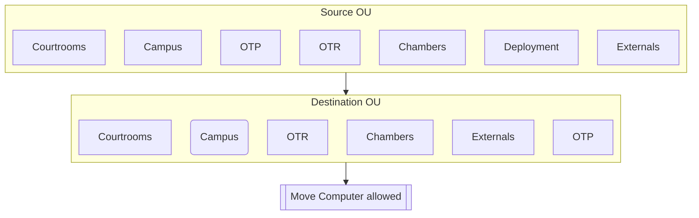

# Move computer flow

The `Move Computer` flow allows the SD to move computers, if the source and destination meet the requirements.

```mermaid
flowchart-elk TB
subgraph source[Source OU]
    cam[Campus]
    cha[Chambers]
    cou[Courtrooms]
    dep[Deployment]
    epn[Externals]
    otp[OTP]
    otr[OTR]
end
subgraph destination[Destination OU]
    cam2(Campus)
    cha2[Chambers]
    cou2[Courtrooms]
    epn2[Externals]
    otp2[OTP]
    otr2[OTR]
end
source --> destination
destination --> move[[Move Computer allowed]]
```