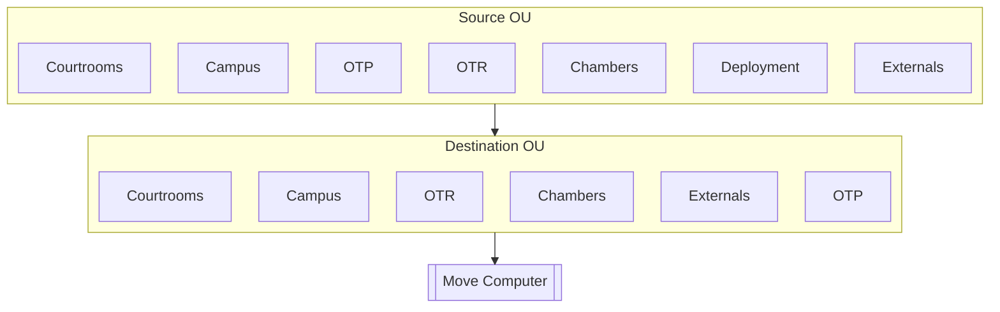

# Move computer flow

The `Move Computer`flow works as follows:

```mermaid
flowchart-elk TB
subgraph source[Source OU]
    cam[Campus]
    cha[Chambers]
    cou[Courtrooms]
    dep[Deployment]
    epn[Externals]
    otp[OTP]
    otr[OTR]
end
subgraph destination[Destination OU]
    cam2[Campus]
    cha2[Chambers]
    cou2[Courtrooms]
    epn2[Externals]
    otp2[OTP]
    otr2[OTR]
end
source --> destination
destination --> move[[Move Computer]]
```