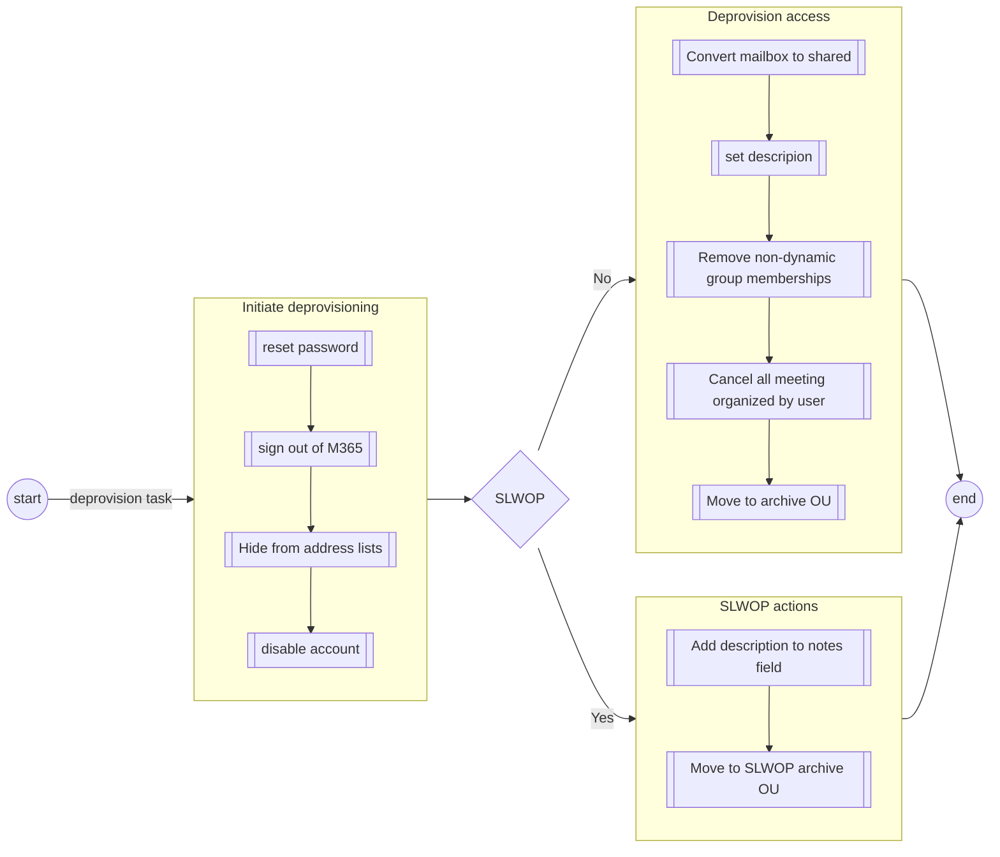

```mermaid
flowchart LR
    subgraph standard [Initiate deprovisioning]
        direction TB
        reset[[reset password]] --> signout[[sign out of M365]]
        signout --> addresshide[[Hide from address lists]]
        addresshide --> disable[[disable account]]
    end
    subgraph noslwopactions [Deprovision access]
    direction TB
        convertshared[[Convert mailbox to shared]] --> noslwopdesc[[set descripion]]
        noslwopdesc -->  removegroups[[Remove non-dynamic group memberships]]
        removegroups -->CancelMeetings[[Cancel all meeting organized by user]]
        CancelMeetings --> archive[[Move to archive OU]]
    end
    subgraph slwopactions [SLWOP actions]
        direction TB
        description[[Add description to notes field]] --> slwoparchive[[Move to SLWOP archive OU]]
    end
    start((start)) -- deprovision task --> standard
    standard --> slwop{SLWOP}
    slwop -- No --> noslwopactions
    slwop -- Yes --> slwopactions
    noslwopactions --> finish
    slwopactions --> finish
    finish((end))
```