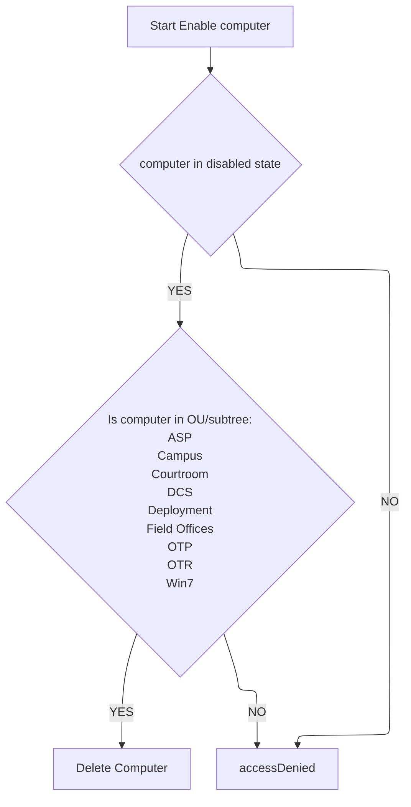

```mermaid
    flowchart-elk
    status{computer in disabled state}
    start[Start Enable computer]
        validation{Is computer in OU/subtree:
        ASP
        Campus
        Courtroom
        DCS
        Deployment
        Field Offices
        OTP
        OTR
        Win7}
    Delete[Delete Computer]
start --> status
status --> |NO| accessDenied
status --> |YES| validation
validation --> |NO| accessDenied
validation --> |YES| Delete
```