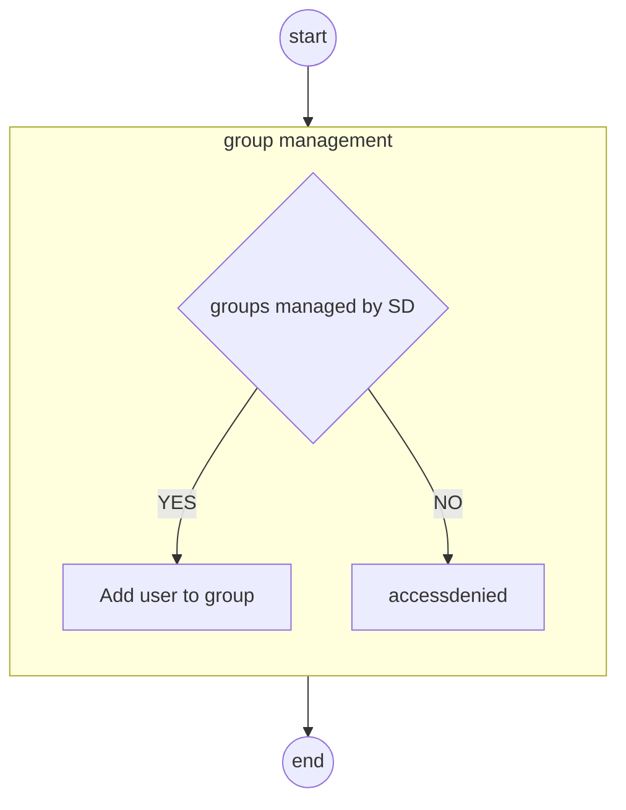

```mermaid
flowchart TB
%% Nodes
start((start))
    subgraph group [group management]
    direction TB
        managedgroup{groups managed by SD}-->|YES|add[Add user to group]
        managedgroup{groups managed by SD}-->|NO|accessdenied[accessdenied]
    end
start --> group
group --> finish((end))
```