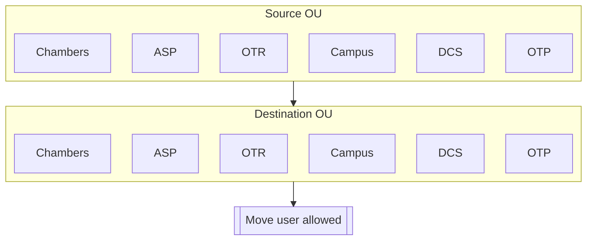

# Move computer flow

The `Move User` flow allows the SD to move users, if the source and destination meet the requirements.

```mermaid
flowchart-elk TB
subgraph source[Source OU]
    aspfrom[ASP]
    camfrom[Campus]
    chafrom[Chambers]
    dcsfrom[DCS]
    otpfrom[OTP]
    otrfrom[OTR]
end
subgraph destination[Destination OU]
    aspto[ASP]
    camto[Campus]
    chato[Chambers]
    dcsto[DCS]
    otpto[OTP]
    otrto[OTR]
end
source --> destination
destination --> move[[Move user allowed]]
```