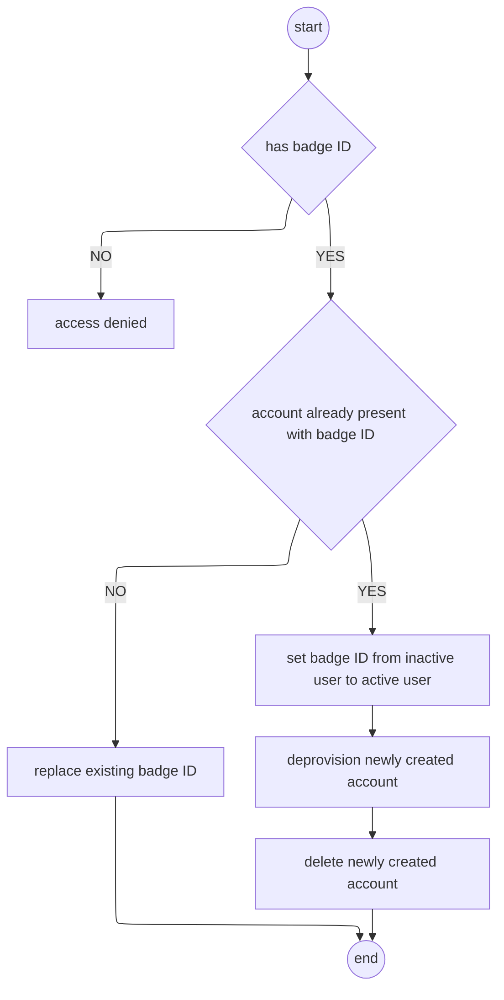

```mermaid
flowchart-elk
%% Nodes
start((start))
hasbadgeID{has badge ID}
accessdenied[access denied]
badgeidpresent{account already present with badge ID}
setbadgeIDtarget[set badge ID from inactive user to active user]
replaceID[replace existing badge ID]
deprovision[deprovision newly created account]
delete[delete newly created account]
finish((end))
%%linking
start -->hasbadgeID
hasbadgeID --> |NO| accessdenied
hasbadgeID --> |YES| badgeidpresent
badgeidpresent --> |YES| setbadgeIDtarget -->deprovision-->  delete --> finish
badgeidpresent -->|NO|replaceID --> finish
```