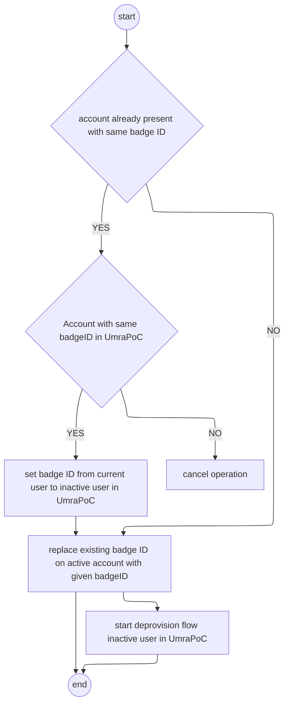

```mermaid
flowchart-elk
%% Nodes
start((start))
umrapoc{Account with same badgeID in UmraPoC}
badgeidpresent{account already present with same badge ID}
setbadgeIDtarget[set badge ID from current user to inactive user in UmraPoC]
replaceID[replace existing badge ID on active account with given badgeID]
deprovision[start deprovision flow inactive user in UmraPoC]
cancel[cancel operation]
finish((end))
%%linking
start -->badgeidpresent
badgeidpresent --> |YES|umrapoc
umrapoc --> |NO| cancel
umrapoc --> |YES| setbadgeIDtarget--> replaceID --> deprovision -->  finish
badgeidpresent -->|NO|replaceID --> finish
```