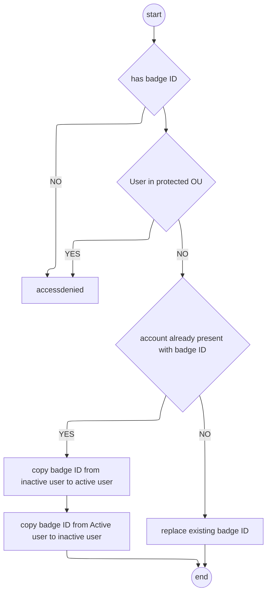

```mermaid
flowchart-elk
%% Nodes
start((start))
hasbadgeID{has badge ID}
protectedOU{User in protected OU}
accessdenied[accessdenied]
badgeidpresent{account already present with badge ID}
copybadgeIDtarget[copy badge ID from inactive user to active user]
copybadgeIDsource[copy badge ID from Active user to inactive user]
replaceID[replace existing badge ID]
finish((end))
%%linking
start -->hasbadgeID --> protectedOU
hasbadgeID --> |NO| accessdenied
protectedOU --> |YES| accessdenied
protectedOU -->|NO| badgeidpresent
badgeidpresent --> |YES| copybadgeIDtarget --> copybadgeIDsource --> finish
badgeidpresent -->|NO|replaceID --> finish
```